# HAY & ĐẸP. Reference Restoration — Re-Authored Shot Plan

**Video Target:** `video001` (*Có những bữa cơm sau này mới hiểu là rất quý*)  
**Duration:** 1442 frames, 48.07 seconds @ 30 fps  
**Reference Model:** `resources/video-references/_analysis/HAY_DEP_REFERENCE_MASTER_REPORT.md`  

---

## 1. Executive Comparison: Current vs Restored Shot Plan

| Metric | Current Production (`final.mp4`) | Restored Reference Plan | Target Benchmark |
|---|---|---|---|
| **Total Visual Shots** | 13 visual segments | **17 visual beats** | 15–17 beats |
| **Visual Changes / Min** | 14.98 / min | **19.97 / min** | 18.0 – 22.0 / min |
| **Median Visual Hold** | 3.57s | **2.70s** | 2.50 – 3.40s |
| **Max Static Hold** | 5.97s (Scene 3) | **4.00s** (Scene 10 Question) | ≤ 4.00s |
| **Holds > 4.0s** | 5 shots (49.6% runtime) | **0 shots (0% runtime)** | 0 shots |
| **Shot-Scale Distribution** | Wide: 3, Med: 7, Close: 0, Detail: 2 | **Wide: 3, Med: 7, Close: 3, Detail: 3, Outro: 1** | Balanced variety |
| **Dead Space Left/Right** | Up to 26.85% (asymmetric) | **≤ 8.33% (centered, balanced)** | ≤ 12–15% |
| **New AI Generations** | None needed | **0 new calls (100% intelligent asset reuse)** | Minimized waste |

---

## 2. Re-Authored 17-Shot Narrative Progression

```mermaid
graph TD
  S01A["Shot 01A (0-65)<br/>WIDE: Family dinner establishing"] --> S01B["Shot 01B (65-141)<br/>CLOSE: Parents & child smiling"]
  S01B --> S02["Shot 02 (141-230)<br/>MEDIUM: Adult serving rice"]
  S02 --> S03A["Shot 03A (230-298)<br/>MEDIUM: Parent arriving home"]
  S03A --> S03B["Shot 03B (298-409)<br/>CLOSE: Conversing warmly at table"]
  S03B --> S04A["Shot 04A (409-478)<br/>MEDIUM: Domestic table context"]
  S04A --> S04B["Shot 04B (478-559)<br/>DETAIL: Hand setting phone aside"]
  S04B --> S05["Shot 05 (559-666)<br/>MEDIUM: Sharing small school story"]
  S05 --> S06["Shot 06 (666-773)<br/>MEDIUM: Thoughtful evening reflection"]
  S06 --> S07["Shot 07 (773-871)<br/>DETAIL: Quiet pause holding bowl"]
  S07 --> S08A["Shot 08A (871-956)<br/>MEDIUM: Seated in anticipation"]
  S08A --> S08B["Shot 08B (956-1058)<br/>DETAIL: Clean phone-free tabletop"]
  S08B --> S09A["Shot 09A (1058-1136)<br/>WIDE: Memory echo paper frame"]
  S09A --> S09B1["Shot 09B1 (1136-1200)<br/>WIDE: Empty chairs in afternoon"]
  S09B1 --> S09B2["Shot 09B2 (1200-1261)<br/>CLOSE: Empty chair in sunlight"]
  S09B2 --> S10["Shot 10 (1261-1381)<br/>MEDIUM: Adult with cup + Question card"]
  S10 --> S11["Shot 11 (1381-1442)<br/>OUTRO: Brand outro card"]
```

---

## 3. Detailed Shot-by-Shot Specification

### Scene 1: Opening Hook (Frames 0–141, 4.70s)
- **Shot 01A (Frames 0–65, 2.17s) — WIDE**:
  - *Voice:* "Khi còn nhỏ, một bữa cơm đủ người"
  - *Visual:* Full establishing view of family sitting together around the warm dinner table.
  - *Asset:* `shot-01.jpg` (Scale: 1.0, centered).
- **Shot 01B (Frames 65–141, 2.53s) — CLOSE**:
  - *Voice:* "thường chỉ là chuyện rất bình thường."
  - *Visual:* Punch-in crop on child and mother smiling and eating. Eliminates the 4.7s static opening and establishes emotional intimacy.
  - *Asset:* `shot-01.jpg` (Crop: scale 1.38, center focus x: 0.48, y: 0.55).

### Scene 2: The Core Value (Frames 141–230, 2.97s)
- **Shot 02 (Frames 141–230, 2.97s) — MEDIUM**:
  - *Voice:* "Giá trị của bữa cơm không nằm ở món ăn cầu kỳ"
  - *Visual:* Adult quietly serving rice into a plain ceramic bowl with chopsticks.
  - *Asset:* `shot-02.jpg` (Scale: 1.0).

### Scene 3: Reconnection After a Long Day (Frames 230–409, 5.97s)
- **Shot 03A (Frames 230–298, 2.27s) — MEDIUM**:
  - *Voice:* "mà ở việc mọi người cùng có mặt,"
  - *Visual:* Parent returning home, placing bag down, sitting at dining table with child.
  - *Framing Fix:* **Centered visual window** (no more `left: 0` dead space).
  - *Asset:* `shot-03.jpg` (Scale: 1.05).
- **Shot 03B (Frames 298–409, 3.70s) — CLOSE**:
  - *Voice:* "nghe vài câu chuyện vụn và nhìn thấy nhau sau một ngày dài."
  - *Visual:* Closer emotional portrait crop on child's expressive face and parent listening attentively.
  - *Asset:* `shot-03.jpg` (Crop: scale 1.40, center focus x: 0.45, y: 0.46).

### Scene 4: The Phone Deliberately Set Aside (Frames 409–559, 5.00s)
- **Shot 04A (Frames 409–478, 2.30s) — MEDIUM**:
  - *Voice:* "Có thể là một mâm cơm đơn giản có đủ người."
  - *Visual:* Domestic table context and family meal setting.
  - *Asset:* `shot-04.jpg` (Scale: 1.0, centered).
- **Shot 04B (Frames 478–559, 2.70s) — DETAIL**:
  - *Voice:* "Hoặc chiếc điện thoại được đặt sang một bên."
  - *Visual:* Tight detail insert on hand placing the smartphone face-down on a side shelf away from the dining table.
  - *Asset:* `shot-04.jpg` (Crop: scale 1.45, focus x: 0.65, y: 0.58).

### Scene 5: School & Work Stories (Frames 559–666, 3.57s)
- **Shot 05 (Frames 559–666, 3.57s) — MEDIUM**:
  - *Voice:* "Có khi chỉ là câu chuyện nhỏ sau một ngày đi học, đi làm."
  - *Visual:* Parent and child talking; centered, balanced window.
  - *Asset:* `shot-05.jpg` (Scale: 1.05).

### Scene 6: Everyday Domestic Reality (Frames 666–773, 3.57s)
- **Shot 06 (Frames 666–773, 3.57s) — MEDIUM**:
  - *Voice:* "Những chi tiết như vậy không tạo cảm giác mình vừa thay đổi cả cuộc sống."
  - *Visual:* Adult standing in quiet evening kitchen reflection.
  - *Asset:* `shot-06.jpg` (Scale: 1.0).

### Scene 7: Meaning in Small Moments (Frames 773–871, 3.27s)
- **Shot 07 (Frames 773–871, 3.27s) — DETAIL / MEDIUM**:
  - *Voice:* "Nhưng chính vì nhỏ, chúng có cơ hội xuất hiện trong những ngày thật."
  - *Visual:* Adult holding plain ceramic bowl, quiet reflective pause.
  - *Asset:* `shot-07.jpg` (Crop: scale 1.15, focus x: 0.5, y: 0.45).

### Scene 8: The Intentional Commitment (Frames 871–1058, 6.23s)
- **Shot 08A (Frames 871–956, 2.83s) — MEDIUM**:
  - *Voice:* "Tuần này, thử giữ lại ít nhất một bữa ăn mà mọi người ngồi cùng nhau"
  - *Visual:* Adult seated at warm dining table in calm anticipation.
  - *Asset:* `shot-08-vb1.jpg` (Scale: 1.0).
- **Shot 08B (Frames 956–1058, 3.40s) — DETAIL**:
  - *Voice:* "và điện thoại không nằm giữa bàn."
  - *Visual:* Top-down clean tabletop: 1 main bowl, 1 side bowl, chopsticks; zero phones, clean wood.
  - *Asset:* `shot-08-vb2.jpg` (Cleaned, human-approved).

### Scene 9: Memory vs Absence (Frames 1058–1261, 6.77s)
- **Shot 09A (Frames 1058–1136, 2.60s) — WIDE (Paper Memory)**:
  - *Voice:* "Có những điều lúc đang có thì rất bình thường."
  - *Visual:* Earlier family meal framed in organic paper border.
  - *Asset:* `shot-01.jpg` with paper border.
- **Shot 09B1 (Frames 1136–1200, 2.13s) — WIDE**:
  - *Voice:* "Đến khi lịch mỗi người khác đi,"
  - *Visual:* Wide afternoon interior showing the quiet dining table with empty chairs.
  - *Asset:* `shot-09-vb2.jpg` (Scale: 1.0).
- **Shot 09B2 (Frames 1200–1261, 2.03s) — CLOSE**:
  - *Voice:* "ta mới biết chúng từng đẹp đến mức nào."
  - *Visual:* Emotional tighter focus on solitary empty chair and golden afternoon sunbeam.
  - *Asset:* `shot-09-vb2.jpg` (Crop: scale 1.35, focus x: 0.45, y: 0.58).

### Scene 10: The Parting Question (Frames 1261–1381, 4.00s)
- **Shot 10 (Frames 1261–1381, 4.00s) — MEDIUM**:
  - *Voice:* "Nhà bạn có bữa ăn nào dù món rất đơn giản nhưng vẫn nhớ lâu không?"
  - *Visual:* Adult holding warm mug, question card overlay.
  - *Asset:* `shot-10.jpg` (Scale: 1.0 -> 1.04 gentle push).

### Scene 11: Brand Outro (Frames 1381–1442, 2.03s)
- **Shot 11 (Frames 1381–1442, 2.03s) — OUTRO**:
  - *Visual:* Full-bleed editorial card with brand mark and tagline.
  - *Asset:* `<OutroCard />`.

---

## 4. Rationale & Quality Summary

1. **Intelligent Asset Multi-Scale Reuse**: By performing 100% lossless vector/matrix crops on high-resolution 1024x1024 master assets, we derive 17 distinct, visually distinct shots with ZERO image generation degradation and ZERO additional API calls.
2. **Elimination of Static Stagnation**: Long holds (Scene 3: 5.97s, Scene 4: 5.00s, Scene 1: 4.70s) are converted into deliberate 2-beat sentences that advance the visual storytelling synchronously with spoken phrases.
3. **Restoration of Reference Scale Grammar**: Wide → Close → Medium → Close → Detail → Wide progression ensures the video never feels monotonous.
