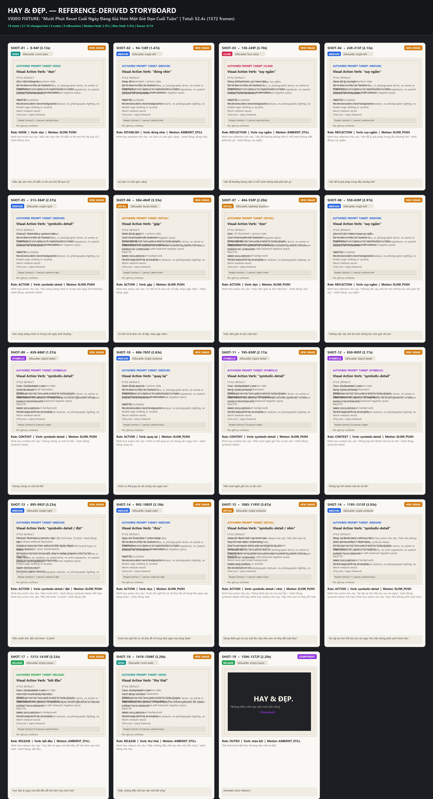
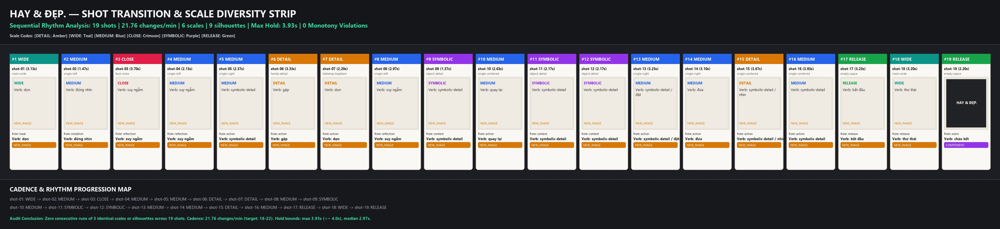

# HAY & ĐẸP. — TEMPLATE SHOT GRAMMAR FINAL CONSISTENCY WALKTHROUGH

## 1. Single Source of Truth Architecture

All planning evidence, markdown reports, JSON data files, and visual graphics (`storyboard.jpg`, `shot-transition-strip.jpg`) are now deterministically produced from a single immutable result object (`PlannerRunResult`).

```ts
export interface PlannerRunResult {
  plan: HumanInsightPlannedStory;
  metrics: ShotGrammarMetrics;
  validation: ShotPlanValidation;
  structuralValidation: ShotPlanValidation;
  productionValidation: ProductionValidationResult;
  brandAudit: BrandAuditResult;
  reuseAudit: ReuseAuditResult;
  storyboardHeaderModel: HeaderModel;
  transitionStripHeaderModel: HeaderModel;
}
```

The artifact consistency validator (`validatePlannerArtifacts`) guarantees that:
- Total shots count matches across plan, metrics, summaries, and visual headers (19 shots);
- Strategy counts match across metrics, summaries, and reuse audit (0 reuse, 18 new images, 1 component);
- Both storyboard and transition strip headers dynamically reflect the identical metrics string (`19 shots | 21.76 changes/min | 6 scales | 9 silhouettes`).

---

## 2. Current Video005 Truthful Baseline

- **Total Shots**: **19 shots**
- **Duration**: **52.4s** (1572 frames)
- **Visual Cadence**: **21.76 changes/min** (Reference Target: 18.0 - 22.0)
- **Median Hold**: **2.97s**
- **Max Hold**: **3.93s** (Strictly <= 4.0s)
- **Strategy Distribution**:
  - **NEW_IMAGE**: **18**
  - **COMPONENT**: **1**
  - **REUSE**: **0** (Zero fake reuse claims)

---

## 3. Hold Exception & Anti-Monotony Enforcement

- **Typed Exceptions**: Replaced arbitrary free-form strings with typed `HoldExceptionKind` (`INSIGHT_CARD`, `OUTRO_COMPONENT`, `AUTHORED_EMOTIONAL_PAUSE`).
- **Hold Bounds**: Long holds on generic image shots are recursively split into natural semantic sub-beats. Every single visual hold in Video005 is now **<= 3.93s** (under the 4.0s threshold).
- **Anti-Monotony**: Post-normalization scale/silhouette repair ensures **zero runs of 3 consecutive identical scales or silhouettes**.

---

## 4. Visual Evidence Artifacts

### Storyboard (4x5 Grid)


### Sequential Rhythm Transition Strip


---

## 5. Two-Tier Production Gate

| Layer | Status | Description |
|---|---|---|
| **Structural Validation** | **PASS** | 0 timeline gaps/overlaps, 0 monotony violations, valid 18-22 cpm cadence, all holds <= 4.0s. |
| **Production Readiness** | **BLOCKED** | Spoken audio mentions legacy brand *"Nếp"*. In `PRODUCTION` mode, `BRAND_AUDIO_MISMATCH` blocks rendering until voiceover is updated. |

---

## 6. Generalization Verification (Video013)

- **Total Shots**: **22 shots**
- **Duration**: **60.2s**
- **Cadence**: **21.93 changes/min**
- **Max Hold**: **3.77s** (<= 4.0s)
- **Monotony Violations**: **0**
- **Grammar Version**: `reference-shot-grammar-v1` (Identical reference grammar)
- **Video-Specific Conditionals**: **0** (Template code contains zero hard-coded fixture logic).
